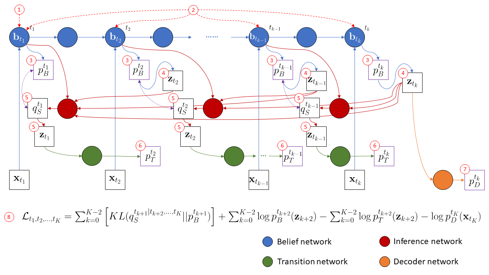
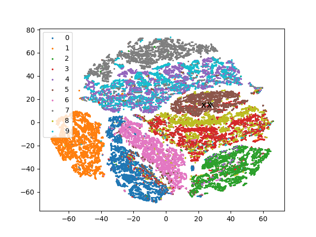
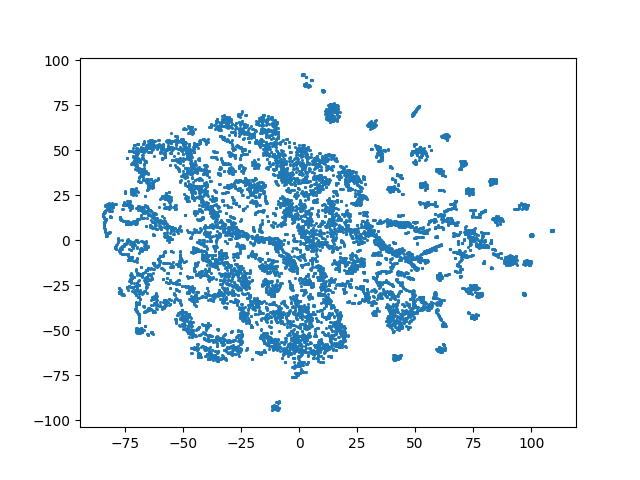

# Stochastic Temporal Difference Learning

In this respository, we implmented our proposed Stochastic Temporal Difference (STD) Learning for sequential data. 

Stochastic Temporal Difference Learning is a general method to learn temporal abstraction that predict future latent states directly
without going through all intermediate states. This learning style mimics human to think and plan with multiple time steps rather than act step by step. We introduce multiple jumpy states in our model, and use VAEs inspired lower bound to learn the latent representation. The latent states not only have the information about how to reconstruct to observation, but also contain the information about how to transit to future states.

## Data Description
* Moving MNIST
* CarRacing-v0 (OpenAI Gym)
* Penn TreeBank

## Experimental Results

* Moving MNIST
  * Rollout result
  
  
  * Latent representation
  

  
  

* CarRacing-v0
  * Rollout result
  
  
  * Latent representation
  

  
  

## Code References
* [https://github.com/cwwang87/self-attention-model](https://github.com/cwwang87/self-attention-model)
* [https://github.com/xqding/TD-VAE](https://github.com/xqding/TD-VAE)
